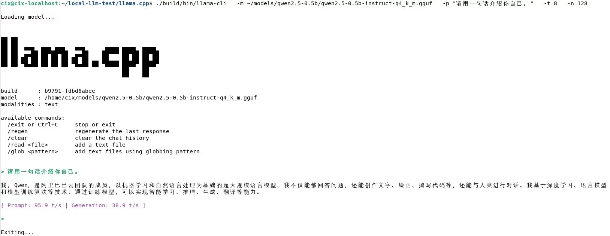

# llama.cpp CPU / KleidiAI

本文档介绍如何在开发板上使用 llama.cpp 的 CPU 路径运行本地 LLM / VLM 模型。

当前页面优先用于验证 llama.cpp 在开发板上的基础可用性。KleidiAI 相关优化以当前框架支持情况和实际编译选项为准。

## 1. 适用场景

* 快速验证本地 LLM / VLM 推理。
* 不依赖 GPU / NPU 的基础模型运行。
* 对比不同 CPU 线程数下的推理性能。
* 验证 GGUF 模型在开发板上的可运行性。

## 2. 前置条件

* 已完成系统启动和网络配置。
* 已安装基础编译工具。
* 已准备 GGUF 模型文件。
* 开发板可用磁盘空间满足模型和编译需求。

## 3. 安装依赖

```bash
sudo apt update
sudo apt install -y git cmake build-essential wget
```

## 4. 获取 llama.cpp

```bash
mkdir -p ~/local-llm-test
cd ~/local-llm-test

git clone https://github.com/ggml-org/llama.cpp.git
cd llama.cpp
```

## 5. 编译 CPU 版本

```bash
cmake -B build
cmake --build build -j$(nproc)
```

编译完成后检查：

```bash
ls build/bin
```

确认存在：

```text
llama-cli
```

## 6. 准备验证模型

llama.cpp 通常使用 GGUF 模型文件。建议优先使用小模型验证基础运行路径，避免模型过大导致下载慢、加载慢或内存不足。

本文档推荐使用 `Qwen2.5-0.5B-Instruct-GGUF` 作为基础验证模型。

模型仓库：

| 平台           | 链接                                                                                              |
| ------------ | ----------------------------------------------------------------------------------------------- |
| ModelScope   | [Qwen/Qwen2.5-0.5B-Instruct-GGUF](https://modelscope.cn/models/Qwen/Qwen2.5-0.5B-Instruct-GGUF) |
| Hugging Face | [Qwen/Qwen2.5-0.5B-Instruct-GGUF](https://huggingface.co/Qwen/Qwen2.5-0.5B-Instruct-GGUF)       |

```{note}
模型文件不建议提交到 GitHub 仓库。请将模型下载到开发板本地目录，例如 `~/models/`。
```

### 6.1 从 ModelScope 下载 GGUF 模型

在开发板上执行：

```bash
mkdir -p ~/models/qwen2.5-0.5b
cd ~/models/qwen2.5-0.5b

wget -O qwen2.5-0.5b-instruct-q4_k_m.gguf \
https://modelscope.cn/models/Qwen/Qwen2.5-0.5B-Instruct-GGUF/resolve/master/qwen2.5-0.5b-instruct-q4_k_m.gguf
```

下载完成后，确认模型文件存在：

```bash
ls -lh ~/models/qwen2.5-0.5b/
```

正常情况下可以看到类似文件：

```text
qwen2.5-0.5b-instruct-q4_k_m.gguf
```

```{warning}
如果文件大小明显异常，例如只有几 KB，说明模型没有完整下载。请删除该文件后重新下载。
```

## 7. 运行模型

进入 llama.cpp 源码目录：

```bash
cd ~/local-llm-test/llama.cpp
```

使用本地 GGUF 文件运行：

```bash
./build/bin/llama-cli \
  -m ~/models/qwen2.5-0.5b/qwen2.5-0.5b-instruct-q4_k_m.gguf \
  -p "请用一句话介绍你自己。" \
  -t 8 \
  -n 128
```

参数说明：

| 参数   | 说明           |
| ---- | ------------ |
| `-m` | 本地 GGUF 模型路径 |
| `-p` | 输入 prompt    |
| `-t` | CPU 线程数      |
| `-n` | 最大生成 token 数 |

## 8. 验证结果

如果终端可以正常加载模型并输出回复，说明 llama.cpp CPU 路径已跑通。

运行成功后，终端会显示 `llama.cpp` 启动信息、模型路径、模型回复以及推理速度统计。



本次验证使用 `Qwen2.5-0.5B-Instruct-GGUF Q4_K_M` 模型，通过 ModelScope 下载到本地，并使用 `-m` 参数指定本地 GGUF 文件运行。

本次验证中，模型可以正常加载并生成中文回复，终端输出的参考性能如下：

| 项目            | 结果                                                        |
| ------------- | --------------------------------------------------------- |
| 验证模型          | `Qwen2.5-0.5B-Instruct-GGUF Q4_K_M`                       |
| 模型路径          | `~/models/qwen2.5-0.5b/qwen2.5-0.5b-instruct-q4_k_m.gguf` |
| CPU 线程数       | `-t 8`                                                    |
| 最大生成 token 数  | `-n 128`                                                  |
| 文本生成          | 成功                                                        |
| Prompt 速度     | 约 95.9 t/s                                                |
| Generation 速度 | 约 38.9 t/s                                                |

```{note}
以上性能数据为当前测试环境下的参考结果，实际结果会受开发板型号、系统版本、llama.cpp commit、模型量化格式、线程数和运行负载影响。
```

## 9. 常见问题

### 9.1 编译失败

检查：

* CMake 是否安装。
* GCC / G++ 是否安装。
* 磁盘空间是否充足。
* 当前 llama.cpp 分支是否支持目标平台。

### 9.2 模型下载失败

如果 Hugging Face 无法访问，建议优先使用 ModelScope 下载模型。

如果 `wget` 卡住或超时，建议：

* 检查开发板网络连接。
* 更换网络环境。
* 在电脑上下载模型后通过 `scp` 传输到开发板。
* 使用公司内部模型源。

通过电脑传输模型示例：

```bash
scp qwen2.5-0.5b-instruct-q4_k_m.gguf cix@<BOARD_IP>:/home/cix/models/qwen2.5-0.5b/
```

### 9.3 模型加载失败

检查：

* 模型文件路径是否正确。
* 模型文件是否完整。
* 模型格式是否为 GGUF。
* 内存是否足够。

检查模型文件：

```bash
ls -lh ~/models/qwen2.5-0.5b/
```

### 9.4 `-hf` 自动拉取模型失败

llama.cpp 支持通过 `-hf` 参数从 Hugging Face 自动拉取模型，但该方式依赖两个条件：

* 开发板可以稳定访问 Hugging Face。
* llama.cpp 编译时启用了 HTTPS 下载支持。

如果出现以下问题：

```text
HTTPS is not supported
failed to download model from Hugging Face
Connection timed out
```

建议不要继续使用 `-hf`，改用本文档中的 ModelScope 手动下载方式，然后通过 `-m` 指定本地 GGUF 模型路径运行。

### 9.5 `pip install huggingface_hub` 失败

在 Debian 12 / Bookworm 等系统中，直接使用 `pip install` 安装 Python 包可能出现：

```text
error: externally-managed-environment
```

这是系统 Python 环境保护机制导致的。本文档不依赖 `huggingface-cli`，无需安装 `huggingface_hub`。建议直接使用 `wget` 从 ModelScope 下载模型。

## 10. 参考资料

* [Arm Learning Path: llama.cpp on Armv9](https://learn.arm.com/learning-paths/cross-platform/ernie_moe_v9/)
* [llama.cpp GitHub Repository](https://github.com/ggml-org/llama.cpp)
* [Qwen2.5-0.5B-Instruct-GGUF on ModelScope](https://modelscope.cn/models/Qwen/Qwen2.5-0.5B-Instruct-GGUF)
