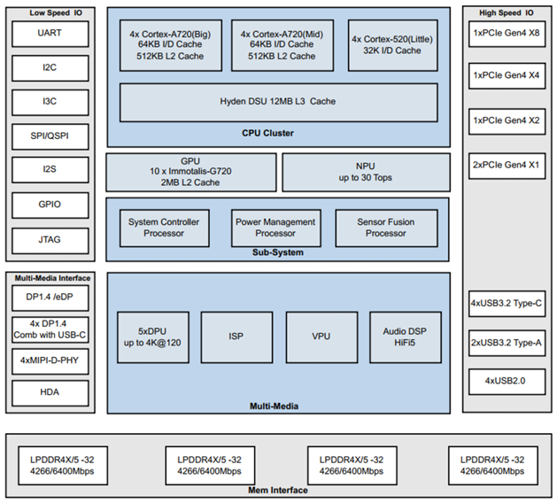

# 1. 概览

本次大赛的主题是Agentic AI智能体应用，开发者可以基于此芯P1硬件平台，通过边端本地推理和端云协同推理等前沿AI技术，实现本地知识库、文档处理、多模态支持等智能体应用在不同行业场景的开发和创新。此芯P1集成了12核Armv9.2 CPU，10核Arm Immortalis G720 GPU，30TOPS NPU以及丰富的接口，硬件框图如下图所示。

本次大赛给开发者提供了多种硬件开发平台选择，除了此芯P1自带的AI算力，还可选配M.2/PCIe AI加速卡（数量有限）。另外，为了满足端云混合AI的需求，开发者也能获得必要的云端大模型Token支持。

<table>
<colgroup>
<col style="width: 19%" />
<col style="width: 44%" />
<col style="width: 35%" />
</colgroup>
<thead>
<tr class="header">
<th><strong>硬件型号</strong></th>
<th><strong>参考配置</strong></th>
<th><strong>（可选）AI加速卡</strong></th>
</tr>
</thead>
<tbody>
<tr class="odd">
<td>瑞莎星睿O6</td>
<td>此芯P1/32GB LPDDR/256GB SSD</td>
<td>后摩LM5030,160TOPS,24GB</td>
</tr>
<tr class="even">
<td>瑞莎星睿O6N</td>
<td>此芯P1/32GB LPDDR/256GB SSD</td>
<td>后摩LQ50,160TOPS,24GB</td>
</tr>
<tr class="odd">
<td>香橙派6 Plus</td>
<td>此芯P1/32GB LPDDR/256GB SSD</td>
<td>N/A</td>
</tr>
<tr class="even">
<td>铭凡MS-R1</td>
<td>此芯P1/32GB LPDDR/1TB SSD</td>
<td>后摩LM5030,160TOPS,24GB</td>
</tr>
<tr class="odd">
<td>天数TY1100-NX</td>
<td>此芯P1/16GB LPDDR/512GB SSD 
天数GPGPU,100TOPS,32GB</td>
<td>默认集成</td>
</tr>
</tbody>
</table>
